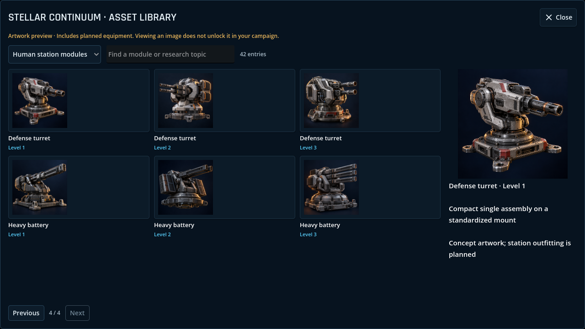
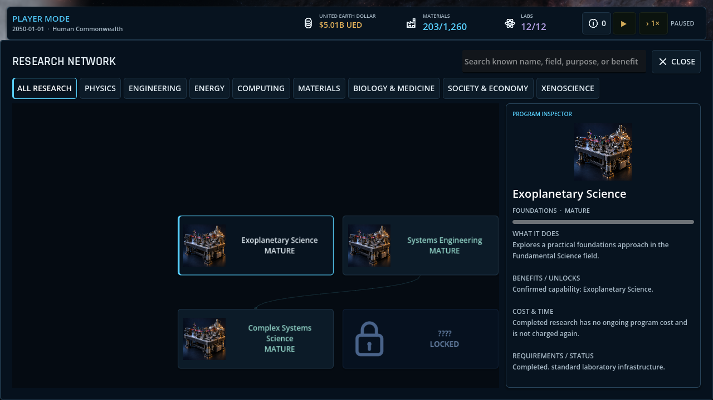

# Module and research artwork

The research network now shows subject illustrations on revealed nodes and a
larger portrait in the program inspector. Begin, Pause and Resume use the existing
research commands and costs. Unknown technology stays concealed, including its
image, name and tooltip.

The asset library is available through **Development → Developer Tools → Module &
research artwork** in a developer campaign. It is an explicit content preview and
can show planned equipment independently of campaign unlocks. Search by name,
filter by race or research, select an image for its larger portrait, and use
Previous/Next to browse. Human module levels 1, 2 and 3 appear side by side.




For a standalone library, launch a Windows export with:

```text
StellarContinuum.exe --windowed --resolution 1280x720 -- --stellar-artwork-library
```

This opens the library before campaign initialization. Closing it exits the
preview; closing the in-game library returns to the paused developer tools.

## Coverage and readiness

| Catalog | Entries | Distinct images | Readiness |
| --- | ---: | ---: | --- |
| Current adaptive research | 370 | 21 | Shared research-family illustrations |
| Human station modules | 42 | 42 | Concept illustrations for 14 families, three upgrades each |
| Alien ship modules | 36 | 36 | Native renders of 12 existing module candidates for each of three races |
| Reserved station research unlocks | 42 | Reuse matching module image | Bindings only; planned nodes are not added to the simulation |

There are 99 distinct images, each supplied at 128×128 and 512×512 pixels.
Research coverage means every current ID has a mapping; it does not mean 370
individually generated research pictures. Existing module readiness has not changed:
this work supplies UI artwork, not new functional outfitting or production 3D meshes.

The human set covers docking, habitats, power, thermal control, cargo, sensors,
research, shipyards, industry, armor, shields, point defense, defense turrets and
heavy batteries. The alien set covers the Pelagic, High-gravity and Cryogenic
module catalogs. Source definitions are pinned to content commit `3aeeb9a4`.

## Files and engine portability

- `assets/visual/catalog/catalog.json`: versioned, explicit ID-to-art mappings,
  names, levels, source model references and readiness descriptions.
- `assets/visual/catalog/thumbnails/`: 128-pixel images for cards and lists.
- `assets/visual/catalog/portraits/`: 512-pixel inspector images.
- `assets/visual/catalog/production/jobs.json`: the 63 prompts used for the shipped
  original generated illustrations.
- `assets/visual/catalog/production/provenance.json`: methods, source/master
  hashes, prompts, square dimensions and delivery hashes for all 99 images.

The JSON and PNGs can be consumed by Stellar Engine independently of Godot.
The C++ editor/runtime still needs its own loader and UI integration; adding the
portable files does not count as a native conversion milestone. Asset IDs are
stable presentation identifiers and never replace authoritative research IDs.

Generated artwork was made with the built-in OpenAI image tool, one separate
generation per illustration, using text prompts and no external reference images.
Alien images were rendered directly from the project's existing GLBs without
geometry changes. Original full-resolution generated masters are retained outside
the repository in the local `outputs/catalog-art-masters` delivery directory.
Only runtime-optimized square PNGs are committed.

## Production and validation

1. Run `python scripts/prepare_catalog_art.py --content-repository <content-checkout>`
   to refresh bindings from the current research catalog and pinned committed
   station/fleet definitions. Review changes before generating assets.
2. Generate each prompt in `production/jobs.json` with the built-in image tool,
   saving a square master under its exact art ID. Keep the original tool outputs.
3. Build the Debug assembly. Run `tools/CatalogArtBake.tscn` with Godot .NET and
   user arguments `--images <masters> --models <content-checkout> --output <catalog-directory>`.
   Either source argument can be omitted. Model rendering requires a GPU.
   The renderer verifies source GLB hashes and uses a fixed studio camera/light rig.
4. Run `python scripts/record_catalog_art_provenance.py --masters <masters> --date YYYY-MM-DD`
   and `python scripts/validate_catalog_art.py`.
5. Import resources with Godot. Set `STELLAR_CAPTURE_FOCUS=catalog-artwork` and
   `STELLAR_SCREENSHOT_DIR=<output-directory>`, then run
   `tools/ScreenshotCapture.tscn` for native UI checks and screenshots.

The coverage gate runs in the normal build workflow. It catches missing mappings,
stale research names, missing images, incorrect PNG dimensions and duplicate
module artwork. New research content must update its art mapping in the same change.
Promoting a planned unlock requires moving its mapping into current research.

Local validation on 2026-09-14:

- Debug and Release builds: no warnings or errors.
- Quality validation: 22/22; simulation validation: 72/72.
- Godot headless import and startup: passed, with `STELLAR_RUNTIME_READY IntegratedMain`.
- Native research checks at 720p and 1080p: search, categories, selection, drag,
  zoom, stable controls, exact costs, Begin/Pause/Resume and concealed subjects.
- Native developer-tools gallery: all four human pages and three race pages have
  real images; Escape returns to paused developer tools.
- Coverage: 370 research bindings, 78 module versions, 42 reserved unlock bindings,
  99 images / 198 delivery files, approximately 30 MiB.
- Windows ExportRelease: executable launched outside the source checkout; the
  standalone library was captured from the exported program and ordinary startup
  reached the runtime-ready marker.

The gallery creates at most 12 cards at once. Thumbnail caching is bounded by the
shipped image identities and portraits use a 12-entry LRU. Campaign state, research
balance and saves are unchanged.
