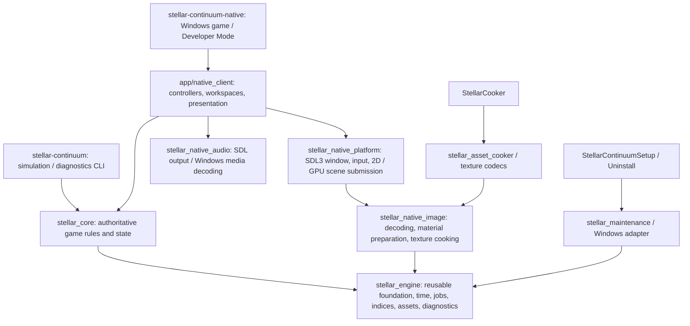

# Stellar Engine and Stellar Continuum architecture

Audited 2026-09-20 on `cpp/codex-native-architecture-integration`.
**Current runtime: custom Stellar Engine, C++23 engine, C++23 game.**
Godot/C# is a deprecated predecessor retained for historical parity fixtures;
it is not a dependency of the native game. Do not introduce Unity or Unreal.

## Ownership and executable structure

The diagram describes CMake ownership, not a universal entity framework.
Engine must not depend on Core. Core owns civilization, research, economy,
fleet, diplomacy, combat, galaxy and celestial rules. App consumes commands and
observer-safe snapshots; it must not implement a second simulation.

| Directory / target | Responsibility | Important entry points |
| --- | --- | --- |
| `engine/`, `stellar_engine` | Generational IDs, fixed clock/RNG, worker pool, owner-thread event queue, atomic files, versioning, asset registry, diagnostics and reusable geometry/query utilities | `foundation.hpp`, `runtime_diagnostics.hpp`, `asset_registry.hpp` under `engine/include/stellar/engine/` |
| `core/`, `stellar_core` | Authoritative campaign records, commands, deterministic stepping, validation and persistence | `integrated_adaptive_campaign.hpp`, `campaign_frame.hpp`, `campaign_coordinator.hpp` under `core/include/stellar/core/` |
| `app/native_client/` | Menu/campaign lifecycle, input routing, map/system/globe, production/research/fleet/economy/diplomacy/planetary workspaces | `main.cpp`, `native_campaign_session.cpp`, `native_system_view.cpp`, `native_planetary_screen.hpp` |
| `app/headless_main.cpp` | Headless entry, diagnostics and simulation modes | `app/developer_qa_host.cpp`, `app/galaxy_main.cpp` |
| `installer/` | Version-aware per-user offline maintenance and native UI | `maintenance.cpp`, Windows platform adapter and Setup entry; see [installer](WINDOWS_INSTALLER.md) |
| `data/`, `export/` | Versioned domain catalogs, reviewed asset allowlists, export recipes, authoritative engine/game version | `export/runtime-config.json`, `data/planets/planet-types-v1.json` |
| `native-tests/` | Native regressions, historical parity fixtures, scale and real renderer tests | CTest registration in root `CMakeLists.txt` and `cmake/` |
| `tools/` | Development-only imports, shader build, export, cook/release/update construction | `build-cooked-game.ps1`, `build-release-installer.ps1`, `build-update-installer.ps1` |

## Simulation, time and threading

`CampaignFrame` coordinates strategic and tactical clocks and the
`IntegratedAdaptiveCampaignRuntime`; subsystem mutations belong to its owner.
Core services own research pressure/eligibility/funding/outcomes, economic
transactions, construction, travel, observation, diplomacy and combat state.
Save/load round trips and parity fixtures constrain changes to these rules.

Engine provides `FixedClock`, `DeterministicRandom`, `EntityRegistry`,
`EventQueue<T>` and `JobSystem`. These are real tested primitives. Existing
gameplay still uses domain-specific IDs and containers: it is **not** an ECS,
task-graph scheduler or simulation-LOD implementation. The event queue enforces
one owner thread; it is not a cross-thread global event bus.

Campaign generation/loading and bounded image preparation run off the UI thread.
Core state publication, commands and GPU submission remain controlled by their
owners. Image preparation reserves retained decoded bytes before admission,
including mip tails and CPU fallbacks. Never remove this accounting to conceal
an allocation failure. Jobs receive immutable inputs; cancellation and lifetime
are explicit at the application/cache boundary.

The native campaign epoch is 21 March 2050. Calendar text uses 24-hour time.
Strategic time, bounded visual orbital time, cosmetic spin and stellar activity
have different purposes. Flares use a persisted unscaled activity clock so
strategic speed does not increase their frequency. Planet/rock cosmetic motion
must stay slow, with per-object axes and tidal-lock handling. Do not couple
these clocks as an incidental renderer cleanup.

## Rendering

Windows native presentation uses a pinned SDL3 distribution, SDL 2D/UI drawing
and an SDL GPU 3D scene adapter with embedded, hash-verified SPIR-V shaders.
The verified graphics path is Vulkan. A runnable alternative GPU backend and
Linux/macOS client are not established by this audit.

`native_scene3d.hpp` defines validated cameras, meshes, materials, lights and
instances; `native_scene3d_gpu.cpp` owns GPU lifetime, bounded residency and
submission. Double-precision world positions are made camera-relative before
float GPU submission. Scene caps, mesh/texture cache bounds, cached uploads,
mipmaps and selective anisotropic/cubic magnification exist. This is a bounded
CPU-submitted scene renderer, not a render graph, bindless/indirect renderer or
virtual-texture engine.

`PlanetAppearance` is canonical shared saved identity, not a renderer-local
random choice. System view, globe and inspection reuse its material, rings,
class, subclass and axis. Supplied art is prepared into surface/response maps;
lighting is applied to 3D geometry. No generic cloud cover should be added over
the approved new giant artwork. Rings preserve radial **and angular** detail.
Mean-element satellite orbits and analytic multiple-star orbits use shared
Engine orbit functions, with chart scaling confined to presentation.

Small-body fields use bounded solid meshes, varied/elongated sizes and slow
tumble. Ice has approximate environment reflection/refraction/Fresnel and
absorption, not full traced optics. Stellar eruptions currently use curved
emissive textured meshes. The blurry image-derived volumetric mode was retired
from the production path; its historical report is not current visual policy.

The old separate surface-view implementation was removed before this audit.
The planetary screen is the active colony interface. Do not restore deleted
surface workspaces or claim a currently shipping free-roaming colony terrain
editor based on older documentation.

## Content and saves

The cooker discovers reviewed allowlists, hashes inputs and dependencies,
generates texture mips, tests quality, chooses GPU formats and atomically
publishes chunk-deduplicated `.stpak` generations plus `.stmanifest`. A cooked
marker disables loose fallback. A bounded registry resolves stable aliases;
Core does not open arbitrary editor master paths. See [content](CELESTIAL_CONTENT_STATUS.md)
and [asset pipeline](ASSET_PIPELINE_STATUS.md).

Player17 JSON/DTO persistence includes canonical celestial identity and current
optional extensions. Recovery/migration code retains older formats and appends
reserved Sol moons idempotently. Atomic writes, backups, separate Developer
saves, streaming JSON work and checkpoint validation exist. This is not an
incremental world database, cloud-save service or complete deterministic command
replay system. Large saves still need latency/memory work.

Ordinary native saves default to `%LOCALAPPDATA%/Stellar Continuum/NativePreview`;
Developer saves use its `developer` subdirectory. Local session/crash logs are
under `%LOCALAPPDATA%/Stellar Continuum/Logs`. Never test against the only copy
of a player's save or overwrite a running installed executable.

## Platform and build

Windows x64 / MSVC 2022 is the verified platform. CMake 3.28+ and Ninja are
required; C++23 is mandatory. SDL is downloaded and verified by
`cmake/PinnedSDL3.cmake` against `third_party/SDL3/runtime-lock.json`. Windows image,
audio, shell, codec and installation APIs are intentionally platform-specific.
The headers/codecs under `third_party/` include their licenses and lock records.
Python is a development tool, not a shipped game dependency.

Build and test commands, current failures and prerequisites are in
[AGENT_HANDOFF.md](AGENT_HANDOFF.md) and [the audit receipt](validation/2026-09-20-development-sync.md).
The detailed [migration contracts](engine/ARCHITECTURE.md) remain useful history;
this document and the [capability matrix](ENGINE_CAPABILITIES.md) govern current scope.
