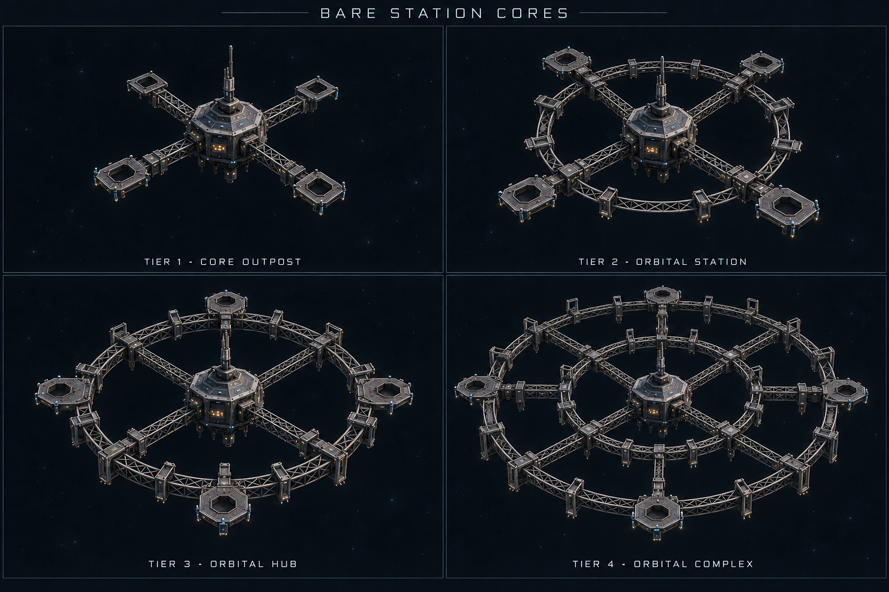
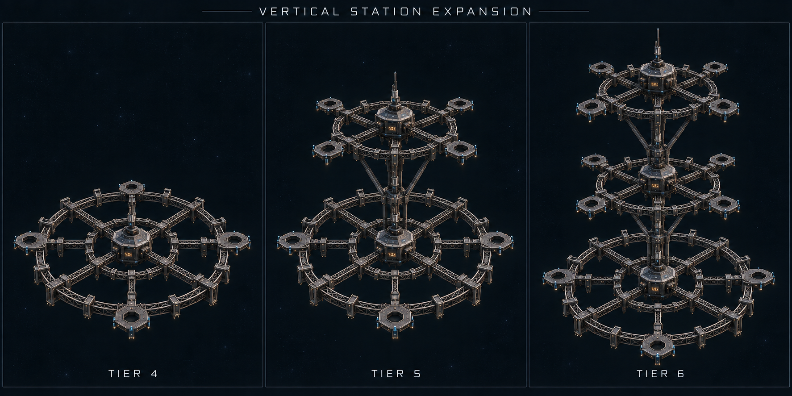
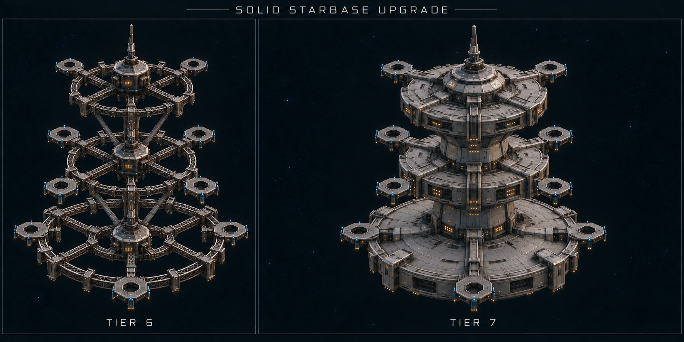
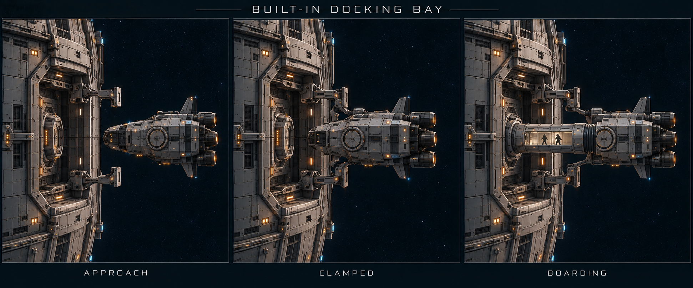
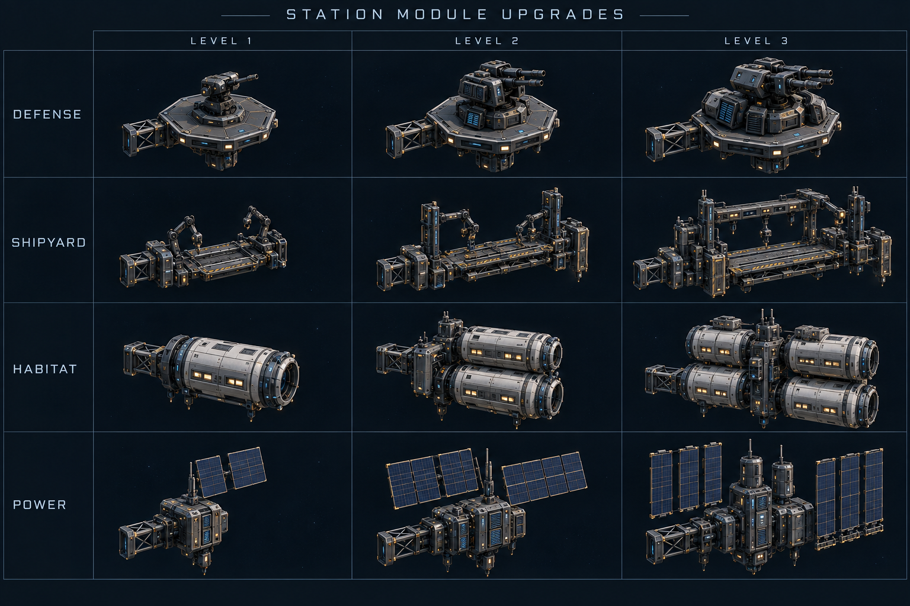

# Human Modular Orbital Station

First content priority — 2026-09-13. Working design ID:
`human_modular_orbital_station`. The user requested weapon hardpoints, other
upgradeable modules and a changed station appearance at every upgrade, then
confirmed **all three roles: general orbital hub, military defense and shipyard /
industry**. This is a new authored station family; it is not yet a playable module
system in either the native engine or the existing game.

## Core design

An armored central command core connects to four permanent radial structural
spines. The original core stays recognizable throughout its life. New rings,
spine extensions and standardized attachment frames create room for additional
modules. Civilian facilities, defensive weapons and shipbuilding equipment can
coexist on the same station, subject to physical space and real support capacity.

Use the existing human fleet language: titanium/slate pressure hulls, dark glass,
exposed service trusses, visible radiators, docking hardware, restrained warm
windows and cool navigation beacons. Service rings and weapon frames are fixed
structure; any future rotating habitat is an independently supported component.

## Bare-core start and research

A new station starts as **Tier 1 with zero installed modules and zero weapons**.
All four general bays and four light hardpoints are empty. The permanent hull
contains basic command, maintenance power, communications, station-keeping and
**built-in docking bays with clamps and boarding tunnels**. These are integral
core systems. A zero-module station can dock compatible ships and transfer
personnel, but has no optional shipyard, research lab, freight terminal or weapon.
Initial assembly and module delivery can use external construction support; a
station must not require its own unbuilt shipyard or research lab to get started.

The player must complete the relevant research before constructing a module or
upgrading it to a new level. Research started or partly completed is insufficient.
Core expansion also requires its target tier's completed research. The bare-start
scenario grants only the initial core technology; module technologies begin locked.
Research can be completed elsewhere in the player's civilization.

Research and physical capacity are separate requirements. A researched module needs
a compatible empty slot, the required core tier, resources and support. A larger core
does not grant module technology. Completed research does not build equipment,
spend construction resources or change the station's appearance by itself.

Modules can be added at **every core tier**, whenever their requirements are met.
Higher tiers retain access to compatible lower-level modules. An empty socket can
receive any researched, supported module level directly; an installed module can
be upgraded separately. The proposed technology chain requires earlier research
levels, not construction and removal of earlier physical modules.

The UI should explain each unavailable action: **Research required**, **Larger core
required**, **No compatible free slot**, or the missing resources/support. Empty
slots remain visible. Removing a module restores an empty slot and does not erase
the owner's completed research.

The machine-readable design lists proposed research IDs and prerequisites. These
are unbound content definitions, not claims that corresponding technology nodes
already exist in the engine. Exact research cost, duration and campaign-tree
placement remain to be designed and connected to authoritative research state.

## Initial station tiers

These are initial design targets. Slot counts and costs are not balanced gameplay
values; module pricing, support requirements and research balancing still need
simulation design and validation. Every tier supports a completely empty layout.

| Tier | Form | Visible change | General module bays | Weapon mounts |
| --- | --- | --- | --- | --- |
| 1 — Core Outpost | Command core and four short arms | Bare exposed frame with empty service connectors and weapon plates | 4 | 4 light |
| 2 — Orbital Station | Extended arms and light service ring | Added structural segments, empty service frames and medium mounting platforms | 8 | 8 light + 4 medium |
| 3 — Orbital Hub | Complete ring and reinforced outer nodes | Larger open truss, additional empty bays and heavy-capable mounting platforms | 12 | 12 light + 4 medium + 2 heavy |
| 4 — Orbital Complex | Second structural ring around the retained core | Expanded empty radial platforms and structural capacity around the retained station | 16 | 16 light + 8 medium + 4 heavy |
| 5 — Stacked Orbital Hub | Retained Tier 4 base plus one upper deck | Reinforced vertical spine, separated upper truss ring, new empty bays and hardpoints | 24 | 24 light + 12 medium + 6 heavy |
| 6 — Orbital Tower | Retained base and first upper deck plus a second upper deck | Taller central spine and another visibly separate structural deck | 32 | 32 light + 16 medium + 8 heavy |
| 7 — Orbital Starbase | Existing three deck levels enclosed into a solid hull | Broad central body, solid deck rims and connecting hull sections fill the gaps | 32, retained | 32 light + 16 medium + 8 heavy, retained |

Fixed docking bays are separate from every module count above. The initial
proposal is **2 / 4 / 6 / 8 / 12 / 16 / 16 built-in bays at Tiers 1–7**. Their
counts, ship classes and sizes remain provisional. Existing bays retain their
identities through upgrades; additional bays begin unoccupied. Tier 7 encloses the
station around the retained docking openings.

New capacity begins as **empty sockets**, not free installed weapons or buildings.
These core tiers are available shapes. What is actually installed determines the
finished silhouette: an industrial hub may have long gantries and cargo banks;
a fortress may concentrate on protection and weapon modules; a populated port
may emphasize docks and habitats. Mixed stations support all three together.

## Vertical growth after Tier 4

At **Tiers 5 and 6, expand upward by stacking new decks on top of the Tier 4
base**. Tier 5 adds the first upper deck; Tier 6 adds a second. These are separate
elevations along a reinforced central service spine, not more rings on the same
plane. Preserve the entire base, earlier decks and their installed modules.

Every new deck adds empty service bays and weapon mounts. The target core tier
requires completed research and construction; adding a deck grants no modules or
module technology. The player equips each deck with compatible researched modules.
The station may still remain completely empty at every supported tier.

Tier 7 then fills the gaps and encloses this stack, as described below. Tiers after
7 remain to be designed rather than automatically adding more decks. Every later
tier requires its own research, supported structure and balance. The initial
capacity proposal is eight general bays, eight light, four medium and two heavy
mounts per added upper deck at Tiers 5 and 6. All counts remain provisional.

Keep deck and socket identities stable. Validate vertical room for large modules,
docking approaches, firing arcs between decks, radiator exposure and construction
access. Power, workers and logistics reach upper decks through the central spine
and structural trunks. Save/reload retains the whole stack and module placement.

## Tier 7 — a solid starbase

Tier 7 **fills the gaps between the existing stacked decks**, turning the open
framework into a much more solid station with the broad, substantial silhouette
of a Starfleet-style starbase. Retain the Tier 4 base, central axis and both upper
decks. A broad central hull, enclosed radial connections, solid deck rims and
stepped shoulders join the three elevations into one coherent structure. The old
deck levels remain recognizable as bands in the new hull. No extra upper deck is
added at this tier.

The enclosure is a researched and constructed **core upgrade**. Its new volume is
structural hull, access passages and unassigned space around the inherited fixed
docking bays. Zero-module stations remain valid, and the enclosure grants no
optional habitat, shipyard, weapon, production or module
research automatically. Functional modules still need their own completed research,
support and construction. The initial slot proposal retains Tier 6's capacity;
this upgrade changes the structural form rather than inventing free equipment.

Preserve all fitted modules and durable socket positions. Keep recessed module
openings, outward-facing weapon hardpoints, docking approaches, firing arcs and
radiator clearance open. Hull panels must fit around their access envelopes. If
a proposed enclosure collides with a fitted module or blocks a required approach,
reject that construction order with a clear reason; never bury, move or delete
equipment silently. Core structural benefits and costs remain to be balanced.

Construction moves from the exposed stack through reinforced connections and
partial hull panels to the completed solid enclosure. Save/reload must retain
the actual enclosure progress and the station's existing loadout.

## Permanent docking bays and boarding tunnels

Every core tier includes **fixed docking bays built into the station hull**.
They have permanent clamp assemblies, a station airlock and an enclosed telescoping
boarding tunnel. They use no module slots and need no separate module research:
their construction and technology are included in that core tier. An otherwise
bare starting station can receive compatible ships and personnel immediately
after the core is commissioned.

A bay is a recessed berth open to space. The ship stays outside the main hull,
secured to the station by clamps engaging its supported docking fixtures. The
tunnel extends from the station airlock to the ship's facing hatch, aligns its
collar and forms an enclosed connection. Bay size, clamp locations, tunnel reach
and hatch compatibility must match the actual ship; author those interfaces before
enabling the ship/bay pairing in gameplay.

The proposed docking sequence is:

1. Reserve a free bay, verify access and ship compatibility, then align the ship.
2. Lock the docking clamps onto the ship's docking fixtures.
3. Extend the boarding tunnel and seal its collar to the ship's hatch.
4. Confirm the connection and compatible airlock environment before opening the
   transfer route. Personnel can then walk through the enclosed tunnel.
5. To depart, stop transfer, close the hatches and retract the tunnel before
   releasing the clamps.

The tunnel carries personnel; the clamps secure the ship. A blocked, damaged,
unsealed or unsupported connection stops transfer and shows its actual state.
Only one ship can occupy a reserved bay. Save/reload retains the ship, bay
reservation, clamps, tunnel, airlock and transfer progress without duplicating
personnel or advancing a stopped sequence.

Optional **docking expansion / traffic modules** remain available for additional
berths or specialized freight and service facilities. Removing one never removes
the core's permanent personnel docking capability. Tier 7 hull panels must preserve
bay openings, clamp movement and tunnel clearance, including during construction.
Do not start enclosure work that conflicts with a docked ship or active route.

## Weapon hardpoints

Mount bases remain visible when empty. A fitted weapon is a separate model whose
base matches the supported mount class. Names and transforms belong to durable
socket records, so upgrading a core does not randomly reposition existing weapons.

- **Light:** point-defense and compact defensive turrets.
- **Medium:** larger direct-fire turrets or contained launcher modules.
- **Heavy:** substantial battery or launcher platforms requiring reinforced mounts.

Each weapon family has three visible equipment levels: compact single housing,
enlarged protected housing with additional support hardware, then a visibly more
capable assembly with reinforced base and expanded cooling. The exact weapon
technology and balance are separate content definitions. A smaller mount does not
accept a heavier weapon merely because the mesh happens to fit.

Define firing direction, traverse limits, muzzle/effect attachments and clearance
volumes. Keep shots clear of the station structure, habitat sections, radiator
panels and docking approaches. Weapon mounts sit on the nonrotating structural
frame. Fire and targeting must ultimately use authoritative combat rules.

## Other modules and their visible upgrades

Every row is an independently upgradeable family. A station does not need to change
its overall tier to upgrade a compatible installed module.

| Module | Level 1 appearance | Level 2 appearance | Level 3 appearance |
| --- | --- | --- | --- |
| Docking expansion / traffic | Additional collar and approach mast | Branching pier with added collars and control booth | Large traffic arm with separated approach lanes and substantial docking structures |
| Habitat / life support | Compact sealed pressure pod | Multi-pod block with visible service plant | Large habitat cluster with expanded environmental-control hardware |
| Power | Compact generator/service pod and solar surfaces | Larger power housing and expanded collector/radiator banks | Reinforced power complex with additional cooling and distribution trunks |
| Thermal control | Fold-out radiator pair | Larger segmented radiator wing | Multiple independently supported radiator banks |
| Cargo / logistics | External container rack | Extended racks and transfer machinery | Large cargo cluster with dedicated handling and freight docks |
| Sensors / communications | Small mast and dish | Larger dish cluster and separated sensor booms | Distributed array with multiple distinct instrument structures |
| Research | Small sealed laboratory | Larger laboratory block with instrument mounts | Multi-lab complex with prominent instruments and service connections |
| Shipyard / repair | Service cradle and repair arms | Open fabrication gantry with additional tooling | Larger multi-section construction dock with expanded cranes and fabrication hardware |
| Industry / fabrication | Compact machinery enclosure | Expanded production block and material-handling fixtures | Large manufacturing cluster with additional logistics and thermal hardware |
| Protection / armor | Local reinforcement and covers | Deeper armor sections and protected service routes | Reinforced outer structural protection with visible independent plating assemblies |

Shield equipment, if introduced by the game's technology rules, would be its own
supported module family and visible emitter hardware. Cosmetic glow does not
create an unimplemented shield capability.

## How upgrades change the station

Core tiers and module levels are separate state. The displayed station is built
from the current core mesh, unlocked socket frames, installed module meshes,
module levels, damage and actual construction state. No single generic station
portrait is stretched or recolored to stand for every upgrade.

1. Check completed owner research for the target core tier or module level, then
   preview the added structure, support demand, costs and affected facilities.
2. Authorize the upgrade at this physical station, reserving the real bay/socket
   and paid work. Deliver materials, workers and equipment through its logistics.
3. Show scaffolding, a partial frame and installation progress. Work visuals stop
   when the job stops. Affected facilities explicitly show downtime where required.
4. Commission the new structure or replacement module only after the work completes.
5. Keep the station's identity, host orbit, existing compatible modules and orders.
   Newly exposed mounts remain empty until the player installs something.

Removing a module leaves its mount visible. Damage affects the actual represented
component, with its own damage visuals. Saves must retain socket IDs, fitted module
types and levels, orientation, damage, paid progress and pending upgrades. Existing
Godot infrastructure construction stages are a useful reference but do not already
provide this persistent modular station system.

## Required production assets

- Four base core-tier models plus reusable upper-deck and vertical-spine models,
  retaining the central core, original coordinate frame and existing deck identities.
- Tier 7 enclosure kit: central hull, deck rims, connecting sections and staged
  hull panels with preserved module access and clearance envelopes.
- Built-in docking bay kit for every core tier: recessed berth, clamp animations,
  telescoping boarding tunnel, sealed hatch/collar variants and personnel route.
- Empty mount frames for light, medium, heavy and general-service connections.
- Independently exported weapon modules, with three visible levels per initial family.
- The ten service-module families above, each with three visibly distinct levels.
- Shared hull materials, decals, attachment helpers and reduced-detail variants.
- Construction, damaged and empty-slot presentation; icons and inspector renders.
- Named module, docking, muzzle, service and effect attachments in the model sources.
- A station assembly manifest and a preview showing core upgrades and module swaps.

The bare-core sheet defines the first four empty hulls; a companion sheet shows
the Tier 4 base growing upward at Tiers 5 and 6. The Tier 7 comparison shows that
stack becoming a solid starbase. The original
tier sheet shows illustrative **equipped configurations after research and paid
construction**, not default loadouts. The module sheet shows separate equipment
levels. All are concept art, not production meshes, balanced slot specifications
or proof of game integration. A dedicated docking sheet specifies the integral
bays, clamps and tunnels added to the core design; earlier silhouette sheets do
not show every docking mechanism. Detailed models and gameplay adapters follow.

## Immediate tasks

| Task | Work |
| --- | --- |
| HS-001 | Station progression, solid Tier 7 and built-in docking concepts |
| HS-002 | Core models, upper decks, Tier 7 enclosure and fixed docking mechanisms |
| HS-003 | Weapon mount and upgrade-module kit |
| HS-004 | Docking, habitat, cargo, power and thermal modules |
| HS-005 | Shipyard, industry, research, sensor and protection modules |
| HS-006 | Construction / damage states, icons, audio and reusable material kit |
| HS-007 | Station assembly preview, Engine Assets registration and dependency checks |
| HS-008 | Native research gates, bare start, construction/combat/logistics/saves and player controls |

The station precedes the player ships in the immediate content roadmap. Shared
materials and docking interfaces flow into the later Pathfinder Scout and fleet packs.

## Acceptance

Upgrading any core or module produces an identifiable geometry change. Empty,
fitted, upgrading, damaged and disabled states are distinguishable. Hub, defensive
and industrial layouts are all possible with the same station family. Mount
identities and installed modules survive save/reload and core expansion. Docking
clearance, firing arcs, power, heat, staffing and logistics remain valid. Visual
capability never exceeds what has actually been installed and commissioned.

Verify a new station has zero modules; all supported core tiers remain valid empty.
Reject module construction and upgrades before completed research, including
partly completed research. Research completion alone leaves the station unchanged.
Reject researched equipment if its core tier or socket is incompatible. Allow it
after both requirements are met, including lower-level modules on a higher-tier
core. Core upgrades preserve installed equipment and add only empty sockets.
Save/reload must preserve an empty station, completed owner research and pending
paid construction without granting equipment or skipping research.
Tiers 5 and 6 must gain visible height through new upper decks; Tier 7 must fill
the gaps without adding a fourth elevation. Preserve the Tier 4 base, previous
decks, socket IDs and installed loadout throughout. Reject enclosure work that
would obstruct fitted modules or their required access.
Verify ships can use built-in docking on a station with zero optional modules.
Preserve fixed bay IDs through upgrades. Require compatible ship fixtures/hatches,
clamp lock and a connected sealed tunnel before personnel transfer. Require tunnel
retraction before unclamping. Verify interrupted docking and transfer save/restore
without duplicated occupants, ships, reservations or progress.
